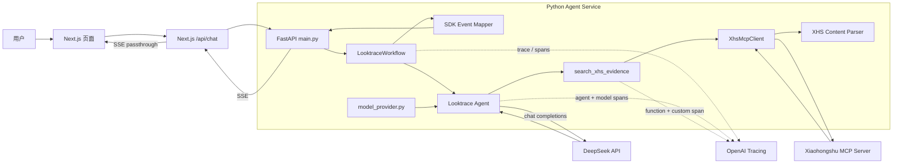
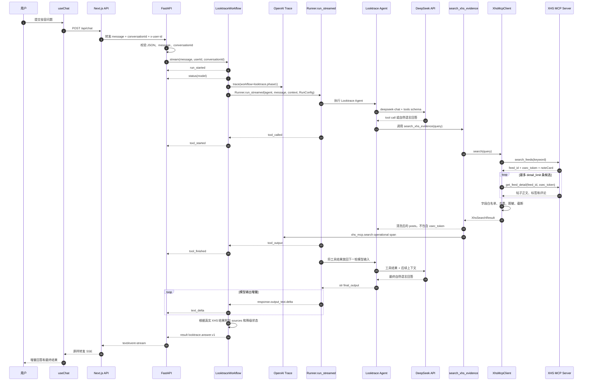
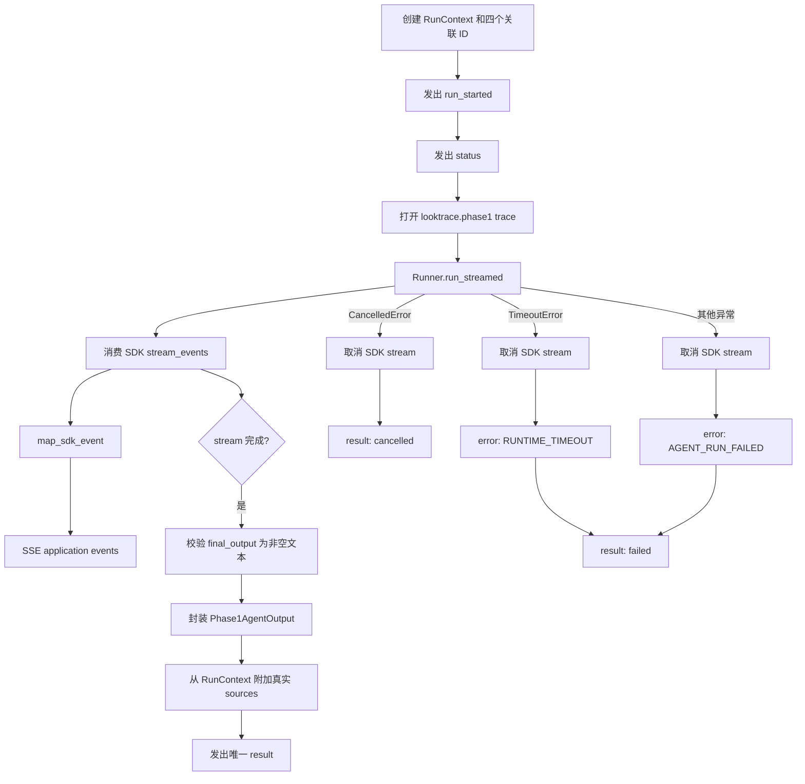
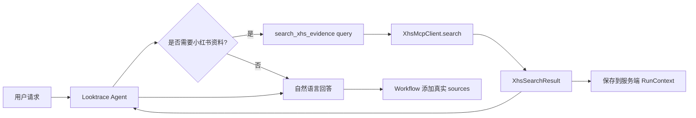
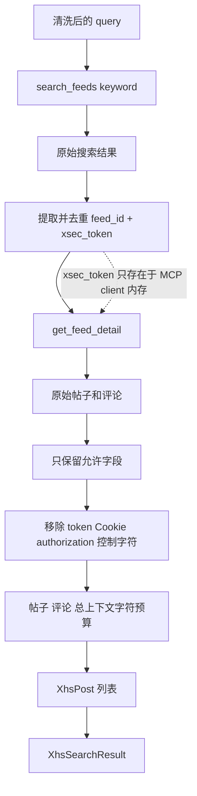
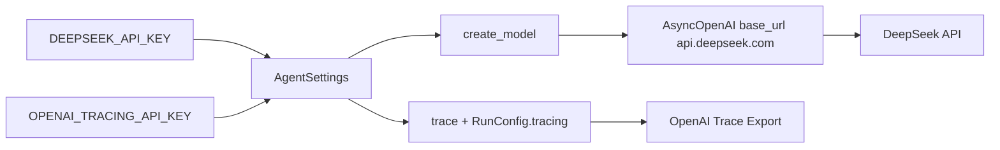
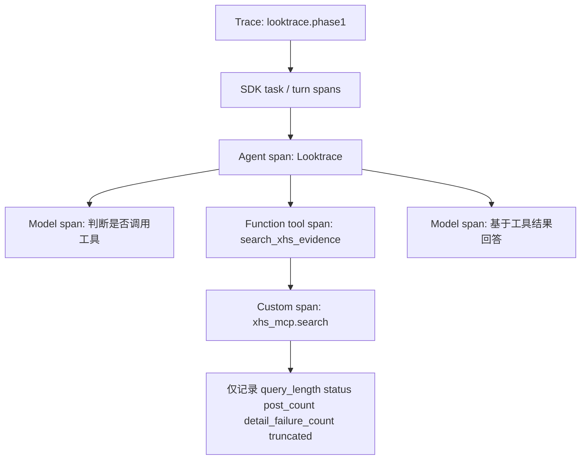
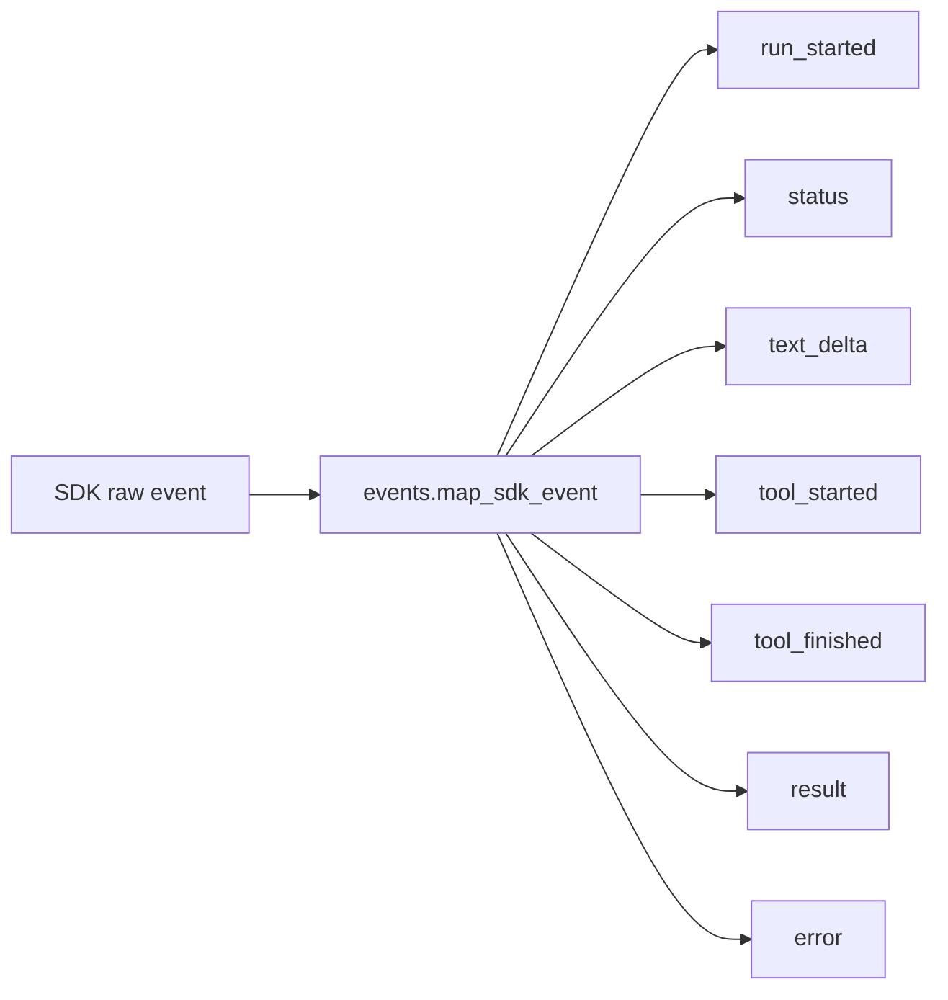
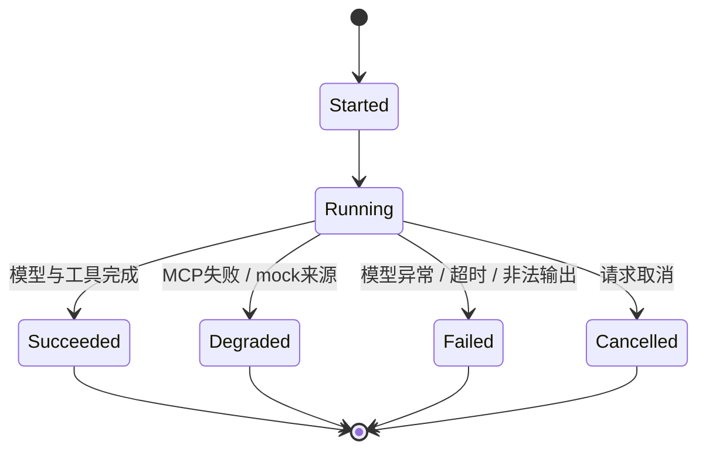
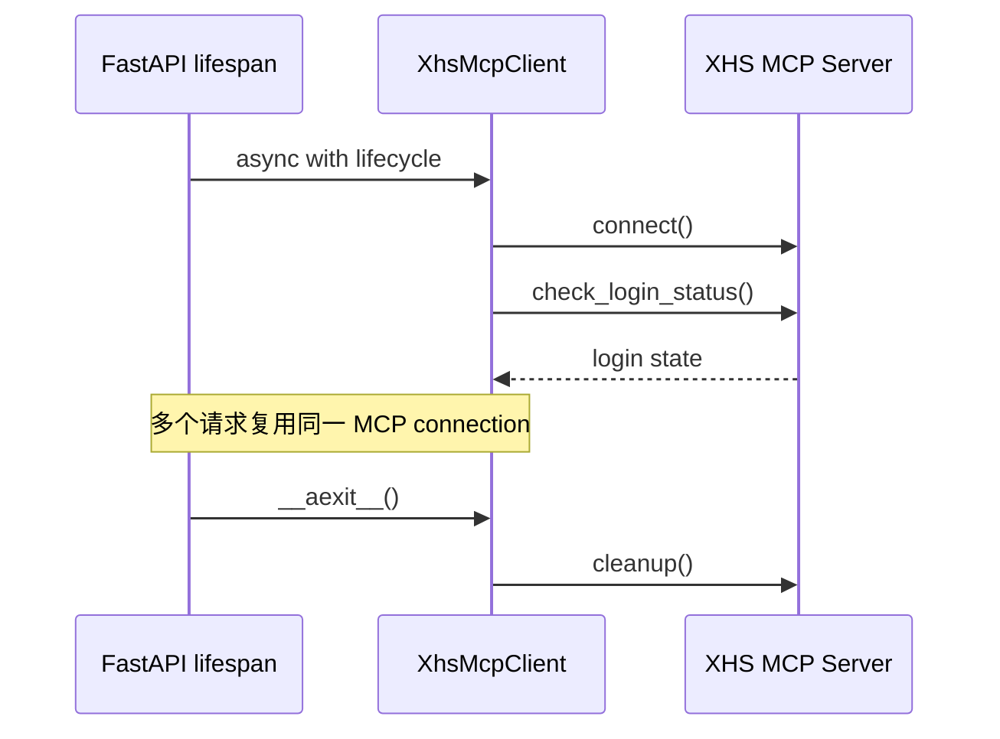

# Agent Service：Phase 1 单 Agent 执行与可观测性

更新时间：2026-09-10

本文对应当前 `agent_service/` 实现，说明一次用户请求如何经过 Next.js、显式工作流、OpenAI Agents SDK 和小红书 MCP，最终以 SSE 返回前端。

Phase 1 的核心约束：

- 只有一个 `Looktrace` Agent。
- Agent 只有一个业务工具：`search_xhs_evidence`。
- 只使用小红书 MCP 的只读能力。
- Agent loop、工具调用和模型调用交给 OpenAI Agents SDK。
- 推理由 DeepSeek `deepseek-chat` 完成，模型凭据只使用 `DEEPSEEK_API_KEY`。
- 应用层编排集中在 `LooktraceWorkflow`，不实现第二套 Agent loop。
- 可观测性只使用 OpenAI Tracing，trace 导出只使用 `OPENAI_TRACING_API_KEY`。
- 不使用 session，不持久化帖子正文和评论。

## 1. 总体架构



### 责任边界

| 模块 | 只负责 |
| --- | --- |
| `main.py` | FastAPI、请求校验、SSE、资源生命周期 |
| `workflow.py` | 一次 Agent run 的显式编排和终态映射 |
| `looktrace_agent.py` | Agent、系统提示词绑定、唯一业务工具 |
| `model_provider.py` | 用 `DEEPSEEK_API_KEY` 创建 DeepSeek client 和 SDK model |
| `events.py` | SDK 原始事件到稳定应用事件的转换 |
| `xhs_integration.py` | MCP 连接、只读白名单、超时和错误分类 |
| `xhs_content.py` | MCP payload 解析、去重、脱敏和内容预算 |
| `schemas.py` | 运行上下文、XHS 结果、Agent 输出和 API 答案 |
| `config.py` | DeepSeek、OpenAI tracing 与 MCP 环境配置 |

## 2. 一次请求的完整时序



## 3. 显式编排层

`LooktraceWorkflow.stream()` 是当前应用侧唯一编排入口。阅读该方法即可看到一轮请求的完整顺序：



OpenAI Agents SDK 负责：

- 调用模型。
- 判断是否调用工具。
- 执行 function tool。
- 将工具结果放回模型上下文。
- 继续运行直到产生最终输出或超过 `max_turns`。
- 记录 Agent、model 和 tool spans。

`LooktraceWorkflow` 负责：

- 创建业务关联 ID。
- 建立 trace 和安全 metadata。
- 设置最大轮次与整体超时。
- 转换 SDK streaming 事件。
- 取消未完成的 SDK stream。
- 根据真实工具结果组装 `looktrace.answer.v1`。
- 保证每次请求只有一个最终 `result`。

## 4. Agent 与工具边界



Agent 不能直接控制：

- `user_id`、`conversation_id`、`trace_id` 和 `agent_run_id`。
- MCP URL、鉴权 token 或 Cookie。
- `feed_id` 和 `xsec_token`。
- 最终 `sources` 列表。
- 任意发布、点赞、评论、收藏或 Cookie 管理工具。

Agent 最终只返回自然语言文本。DeepSeek 当前不接受 Agents SDK 为
Pydantic `output_type` 生成的 structured `response_format`，所以不在模型层
强制结构化输出；`LooktraceWorkflow` 校验非空文本后再封装内部对象：

```text
answer_text   面向用户的完整回答
uncertainty   尚未确认的重要事实
```

来源由 Workflow 从本次真实 `XhsSearchResult` 中附加，模型无法自行创建一个“已验证来源”。对外的 `looktrace.answer.v1` 仍然是稳定的类型化结构。

## 5. XHS MCP 数据边界



允许调用的上游工具固定为：

| MCP 工具 | 使用位置 | Agent 是否直接可见 |
| --- | --- | --- |
| `check_login_status` | 服务启动连接检查 | 否 |
| `search_feeds` | `XhsMcpClient.search()` | 否 |
| `get_feed_detail` | `XhsMcpClient.search()` | 否 |

上游 MCP server 不直接挂载到 `Agent.mcp_servers`。这样既不会暴露写工具，也不会让搜索结果中的临时 `xsec_token` 进入模型上下文。

## 6. OpenAI Tracing

模型调用和 trace 导出使用两套完全独立的凭据：



`OPENAI_TRACING_API_KEY` 不会传给模型 client，`DEEPSEEK_API_KEY` 也不会进入 trace exporter。这样 Agents SDK 仍负责 Agent loop 和 span 层级，但真实推理请求只发送到 `AGENT_MODEL_BASE_URL`。

Agents SDK 0.22.2 的默认 trace exporter 固定发送到 `https://api.openai.com/v1/traces/ingest`，不会读取全局 `OPENAI_BASE_URL`。`OPENAI_API_KEY` 仅作为旧配置的兼容 fallback；当全局 OpenAI 配置指向中转站时，应使用独立的 `OPENAI_TRACING_API_KEY`。



Trace 配置：

| 字段 | 值 |
| --- | --- |
| workflow name | `looktrace.phase1` |
| trace ID | 每次请求生成的 `trace_*` |
| group ID | `conversationId` |
| metadata | user、conversation、message、run ID 和 XHS mode |
| sensitive payload | 由 `OPENAI_AGENTS_TRACE_INCLUDE_SENSITIVE_DATA` 控制 |
| model credential | `DEEPSEEK_API_KEY`，仅 DeepSeek client 使用 |
| trace credential | `OPENAI_TRACING_API_KEY`，仅 tracing config 使用 |

`run_started` 和最终 `result` 都返回同一个 `traceId`。通过该 ID 可以在 OpenAI Tracing 中定位对应请求，并查看 Agent、model、function tool 和 XHS operational span 的父子关系。

当 `OPENAI_AGENTS_TRACE_INCLUDE_SENSITIVE_DATA=false` 时，Generation 和
Function span 不保存模型与工具的输入输出。

当该值为 `true` 时：

- Generation span 保存 Agent instructions、用户问题、工具结果上下文和模型输出。
- Function span 保存 `search_xhs_evidence` 的参数与清洗后的工具结果。
- MCP 原始响应、`xsec_token`、Cookie 和 Authorization 仍不会进入 Agent 或 trace。

因此，开发环境可以开启它排查 prompt 和 tool call；真实 MCP 数据涉及帖子正文与评论时，需要明确接受这些清洗后内容上传到 OpenAI Tracing。

## 7. SSE 契约

SDK 原始事件只存在于 Python 服务内部。前端依赖以下稳定事件：



| 事件 | 主要字段 | 用途 |
| --- | --- | --- |
| `run_started` | `run`, `conversation` | 建立本轮关联 ID |
| `status` | `phase`, `message` | 展示当前执行阶段 |
| `text_delta` | `text` | 增量展示模型文本 |
| `tool_started` | `toolName`, `callId`, `inputSummary` | 展示工具开始 |
| `tool_finished` | `status`, `outputSummary`, `errorCode` | 展示工具结果摘要 |
| `error` | `code`, `message` | 表达可解释失败 |
| `result` | `answer`, `answerText`, `status`, `run` | 唯一业务终态 |

`inputSummary` 只包含 query 长度，`outputSummary` 只包含工具状态和帖子数量。

## 8. 状态与失败路径



| 场景 | 工具结果 | 最终状态 |
| --- | --- | --- |
| MCP 正常并返回帖子 | `succeeded` | `succeeded` |
| MCP 未启动 | `XHS_MCP_UNAVAILABLE` | `degraded` |
| MCP 鉴权失败 | `XHS_MCP_UNAUTHORIZED` | `degraded` |
| 小红书未登录 | `XHS_NOT_LOGGED_IN` | `degraded` |
| MCP 请求超时 | `XHS_MCP_TIMEOUT` | `degraded` |
| MCP 连接正常但页面工具失败 | `XHS_MCP_TOOL_FAILED` | `degraded` |
| MCP 返回非法结构 | `XHS_MCP_INVALID_RESPONSE` | `degraded` |
| 搜索无结果 | `XHS_EMPTY_RESULT` | `degraded` |
| mock 测试来源 | 工具可返回内容 | 强制 `degraded` |
| 整体 Agent 超时 | `RUNTIME_TIMEOUT` | `failed` |
| SDK 或模型异常 | `AGENT_RUN_FAILED` | `failed` |
| 客户端取消 | `RUN_CANCELLED` | `cancelled` |

MCP 模式失败时不会自动切换到 mock，也不会生成伪造来源。

## 9. 应用生命周期



MCP 连接失败不会让 FastAPI 进程退出。客户端保留安全错误码，后续请求可以再次尝试连接；服务关闭时由 async context manager 统一执行 cleanup。

## 10. 当前阶段明确不做

- 不使用多 Agent 或 handoff。
- 不使用 Langfuse、自建 audit 或自建 tracing exporter。
- 不建立通用 workflow engine。
- 不使用 SDK session 或数据库会话存储。
- 不接入妆匣、淘宝、SKU hydration 或商品写入工具。
- 不把 MCP server 的全部工具直接交给 Agent。
- 不记录或展示模型隐藏推理。

当前实现的目的，是先验证一条最小但真实的闭环：用户问题进入单 Agent，Agent 自主调用受控的小红书证据工具，基于真实帖子和评论生成回答，并能通过 OpenAI Tracing 还原完整调用层级。

## 11. 真实环境验收记录

验收日期：2026-09-10。上游使用 `xiaohongshu-mcp v2.5.0`，模型使用 `deepseek-chat`，trace exporter 使用独立的 OpenAI Platform key。

| 检查项 | 结果 | 观测 |
| --- | --- | --- |
| MCP 初始化与登录 | pass | `connected=true`、`logged_in=true` |
| 真实内容读取 | pass | 一次搜索返回 2 条详情，包含正文、评论和无 token 来源链接 |
| 适配器耗时 | pass | 搜索加 2 条详情约 39.8 秒 |
| 单 Agent 调用 | pass | 调用 `search_xhs_evidence`，终态 `succeeded`，附带 2 个真实来源 |
| HTTP/SSE L3 | pass | 严格要求工具事件、`succeeded` 和非空真实来源，约 37.7 秒完成 |
| OpenAI Tracing | pass | exporter 目标为官方 `/v1/traces/ingest`，HTTP `204` |
| 敏感 trace 内容 | enabled | Generation 与 Function span 保留输入输出，MCP token 不进入工具结果 |
| MCP 停机降级 | pass | 返回 `XHS_MCP_UNAVAILABLE`、零帖子、`mode=mcp`，不回退 mock |
| 上游日志脱敏 | pass | `npm run xhs:mcp` 将详情 URL 中的 `xsec_token` 替换为 `[redacted]` |

真实搜索页面偶尔会在上游 60 秒等待窗口内加载失败。适配器只对明确的 MCP 工具错误在健康连接上重试一次；连接、鉴权和客户端超时不会无限重试。
